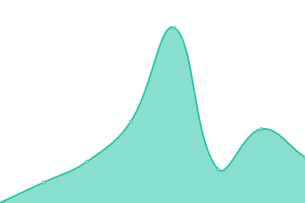

# [📈 Live Status](https://demo.upptime.js.org): <!--live status--> **🟩 All systems operational**

This repository contains the open-source uptime monitor and status page for [holavonat](https://demo.upptime.js.org), powered by [Upptime](https://github.com/upptime/upptime).

With [Upptime](https://upptime.js.org), you can get your own unlimited and free uptime monitor and status page, powered entirely by a GitHub repository. We use [Issues](https://github.com/holavonat/instances/issues) as incident reports, [Actions](https://github.com/holavonat/instances/actions) as uptime monitors, and [Pages](https://demo.upptime.js.org) for the status page.

<!--start: status pages-->
<!-- This summary is generated by Upptime (https://github.com/upptime/upptime) -->
<!-- Do not edit this manually, your changes will be overwritten -->
<!-- prettier-ignore -->
| URL | Status | History | Response Time | Uptime |
| --- | ------ | ------- | ------------- | ------ |
|  [holavonat.hu](https://holavonat.hu/) | 🟩 Up | [holavonat-hu.yml](https://github.com/holavonat/instances/commits/HEAD/history/holavonat-hu.yml) | 

 0ms
     
 | 

<a href="https://demo.upptime.js.org/history/holavonat-hu">100.00%</a>
    

|  [mav-stat.info/map-lite.html](https://mav-stat.info/map-lite.html) | 🟩 Up | [mav-stat-info-map-lite-html.yml](https://github.com/holavonat/instances/commits/HEAD/history/mav-stat-info-map-lite-html.yml) | 

 491ms
     
 | 

<a href="https://demo.upptime.js.org/history/mav-stat-info-map-lite-html">100.00%</a>
    

|  [vonatterkep.hu](https://vonatterkep.hu) | 🟩 Up | [vonatterkep-hu.yml](https://github.com/holavonat/instances/commits/HEAD/history/vonatterkep-hu.yml) | 

 232ms
     
 | 

<a href="https://demo.upptime.js.org/history/vonatterkep-hu">100.00%</a>
    

|  [ittavonat.eu](https://ittavonat.eu) | 🟩 Up | [ittavonat-eu.yml](https://github.com/holavonat/instances/commits/HEAD/history/ittavonat-eu.yml) | 

 66ms
     
 | 

<a href="https://demo.upptime.js.org/history/ittavonat-eu">100.00%</a>
    

|  [holavonat.is](https://holavonat.is) | 🟩 Up | [holavonat-is.yml](https://github.com/holavonat/instances/commits/HEAD/history/holavonat-is.yml) | 

 141ms
     
 | 

<a href="https://demo.upptime.js.org/history/holavonat-is">100.00%</a>
    

|  [holavonat.kinsta.app](https://holavonat.kinsta.app) | 🟩 Up | [holavonat-kinsta-app.yml](https://github.com/holavonat/instances/commits/HEAD/history/holavonat-kinsta-app.yml) | 

 668ms
     
 | 

<a href="https://demo.upptime.js.org/history/holavonat-kinsta-app">100.00%</a>
    

|  [holavon.at](https://holavon.at) | 🟩 Up | [holavon-at.yml](https://github.com/holavonat/instances/commits/HEAD/history/holavon-at.yml) | 

 393ms
     
 | 

<a href="https://demo.upptime.js.org/history/holavon-at">100.00%</a>
    

<!--end: status pages-->

[**Visit our status website →**](https://demo.upptime.js.org)

## 📄 License

- Powered by: [Upptime](https://github.com/upptime/upptime)
- Code: [MIT](./LICENSE) © [Anand Chowdhary](https://anandchowdhary.com), supported by [Pabio](https://pabio.com)
- Data in the `./history` directory: [Open Database License](https://opendatacommons.org/licenses/odbl/1-0/)
