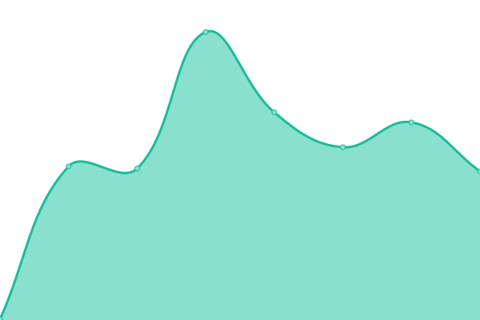

# [📈 Live Status](https://demo.upptime.js.org): <!--live status--> **🟧 Partial outage**

This repository contains the open-source uptime monitor and status page for [holavonat](https://demo.upptime.js.org), powered by [Upptime](https://github.com/upptime/upptime).

With [Upptime](https://upptime.js.org), you can get your own unlimited and free uptime monitor and status page, powered entirely by a GitHub repository. We use [Issues](https://github.com/holavonat/instances/issues) as incident reports, [Actions](https://github.com/holavonat/instances/actions) as uptime monitors, and [Pages](https://demo.upptime.js.org) for the status page.

<!--start: status pages-->
<!-- This summary is generated by Upptime (https://github.com/upptime/upptime) -->
<!-- Do not edit this manually, your changes will be overwritten -->
<!-- prettier-ignore -->
| URL | Status | History | Response Time | Uptime |
| --- | ------ | ------- | ------------- | ------ |
|  [holavonat.hu](https://holavonat.hu/) | 🟩 Up | [holavonat-hu.yml](https://github.com/holavonat/instances/commits/HEAD/history/holavonat-hu.yml) | 

 226ms
     
 | 

<a href="https://holavonat.github.io/history/holavonat-hu">100.00%</a>
    

|  [mav-stat.info/map-lite.html](https://mav-stat.info/map-lite.html) | 🟩 Up | [mav-stat-info-map-lite-html.yml](https://github.com/holavonat/instances/commits/HEAD/history/mav-stat-info-map-lite-html.yml) | 

 1005ms
     
 | 

<a href="https://holavonat.github.io/history/mav-stat-info-map-lite-html">100.00%</a>
    

|  [vonatterkep.hu](https://vonatterkep.hu) | 🟩 Up | [vonatterkep-hu.yml](https://github.com/holavonat/instances/commits/HEAD/history/vonatterkep-hu.yml) | 

 311ms
     
 | 

<a href="https://holavonat.github.io/history/vonatterkep-hu">100.00%</a>
    

|  [ittavonat.eu](https://ittavonat.eu) | 🟩 Up | [ittavonat-eu.yml](https://github.com/holavonat/instances/commits/HEAD/history/ittavonat-eu.yml) | 

 263ms
     
 | 

<a href="https://holavonat.github.io/history/ittavonat-eu">100.00%</a>
    

|  [holavonat.is](https://holavonat.is) | 🟩 Up | [holavonat-is.yml](https://github.com/holavonat/instances/commits/HEAD/history/holavonat-is.yml) | 

 350ms
     
 | 

<a href="https://holavonat.github.io/history/holavonat-is">100.00%</a>
    

|  [holavonat.kinsta.app](https://holavonat.kinsta.app) | 🟩 Up | [holavonat-kinsta-app.yml](https://github.com/holavonat/instances/commits/HEAD/history/holavonat-kinsta-app.yml) | 

 890ms
     
 | 

<a href="https://holavonat.github.io/history/holavonat-kinsta-app">100.00%</a>
    

|  [holavon.at](https://holavon.at) | 🟩 Up | [holavon-at.yml](https://github.com/holavonat/instances/commits/HEAD/history/holavon-at.yml) | 

 278ms
     
 | 

<a href="https://holavonat.github.io/history/holavon-at">100.00%</a>
    

|  [hunavonat.hu](http://hunavonat.hu) | 🟥 Down | [hunavonat-hu.yml](https://github.com/holavonat/instances/commits/HEAD/history/hunavonat-hu.yml) | 

 0ms
     
 | 

<a href="https://holavonat.github.io/history/hunavonat-hu">0.00%</a>
    

|  [megisholavonat.info](https://megisholavonat.info) | 🟩 Up | [megisholavonat-info.yml](https://github.com/holavonat/instances/commits/HEAD/history/megisholavonat-info.yml) | 

 647ms
     
 | 

<a href="https://holavonat.github.io/history/megisholavonat-info">100.00%</a>
    

|  [map.realtimenext.hu](https://map.realtimenext.hu) | 🟩 Up | [map-realtimenext-hu.yml](https://github.com/holavonat/instances/commits/HEAD/history/map-realtimenext-hu.yml) | 

 938ms
     
 | 

<a href="https://holavonat.github.io/history/map-realtimenext-hu">100.00%</a>
    

|  [vasutterkep.hu](https://vasutterkep.hu) | 🟥 Down | [vasutterkep-hu.yml](https://github.com/holavonat/instances/commits/HEAD/history/vasutterkep-hu.yml) | 

 770ms
     
 | 

<a href="https://holavonat.github.io/history/vasutterkep-hu">51.59%</a>
    

|  [whataretheytrainingfor.com](https://whataretheytrainingfor.com/) | 🟩 Up | [whataretheytrainingfor-com.yml](https://github.com/holavonat/instances/commits/HEAD/history/whataretheytrainingfor-com.yml) | 

 652ms
     
 | 

<a href="https://holavonat.github.io/history/whataretheytrainingfor-com">100.00%</a>
    

|  [kodbazis.hu/holavonat](https://kodbazis.hu/holavonat) | 🟥 Down | [kodbazis-hu-holavonat.yml](https://github.com/holavonat/instances/commits/HEAD/history/kodbazis-hu-holavonat.yml) | 

 1089ms
     
 | 

<a href="https://holavonat.github.io/history/kodbazis-hu-holavonat">98.77%</a>
    

|  [holavonat.mkkp.party](https://holavonat.mkkp.party/) | 🟩 Up | [holavonat-mkkp-party.yml](https://github.com/holavonat/instances/commits/HEAD/history/holavonat-mkkp-party.yml) | 

 794ms
     
 | 

<a href="https://holavonat.github.io/history/holavonat-mkkp-party">99.71%</a>
    

|  [vonatradar.hu](https://vonatradar.hu) | 🟥 Down | [vonatradar-hu.yml](https://github.com/holavonat/instances/commits/HEAD/history/vonatradar-hu.yml) | 

 327ms
     
 | 

<a href="https://holavonat.github.io/history/vonatradar-hu">0.00%</a>
    

|  [holakurvavonat.com](https://holakurvavonat.com) | 🟥 Down | [holakurvavonat-com.yml](https://github.com/holavonat/instances/commits/HEAD/history/holakurvavonat-com.yml) | 

 187ms
     
 | 

<a href="https://holavonat.github.io/history/holakurvavonat-com">0.00%</a>
    

|  [holakurvaanyambavanavonat.hu (mirror list only)](http://holakurvaanyambavanavonat.hu) | 🟥 Down | [holakurvaanyambavanavonat-hu-mirror-list-only.yml](https://github.com/holavonat/instances/commits/HEAD/history/holakurvaanyambavanavonat-hu-mirror-list-only.yml) | 

 1646ms
     
 | 

<a href="https://holavonat.github.io/history/holakurvaanyambavanavonat-hu-mirror-list-only">98.77%</a>
    

|  [sinenvagyunk.hu](https://sinenvagyunk.hu/) | 🟩 Up | [sinenvagyunk-hu.yml](https://github.com/holavonat/instances/commits/HEAD/history/sinenvagyunk-hu.yml) | 

 294ms
     
 | 

<a href="https://holavonat.github.io/history/sinenvagyunk-hu">99.63%</a>
    

|  [vonat-keses.hu](https://vonat-keses.hu) | 🟩 Up | [vonat-keses-hu.yml](https://github.com/holavonat/instances/commits/HEAD/history/vonat-keses-hu.yml) | 

 19605ms
     
 | 

<a href="https://holavonat.github.io/history/vonat-keses-hu">100.00%</a>
    

|  [holavonat.serverhu.eu](https://holavonat.serverhu.eu) | 🟩 Up | [holavonat-serverhu-eu.yml](https://github.com/holavonat/instances/commits/HEAD/history/holavonat-serverhu-eu.yml) | 

 464ms
     
 | 

<a href="https://holavonat.github.io/history/holavonat-serverhu-eu">60.50%</a>
    

|  [mennyitkesik.com](https://mennyitkesik.com) | 🟩 Up | [mennyitkesik-com.yml](https://github.com/holavonat/instances/commits/HEAD/history/mennyitkesik-com.yml) | 

 544ms
     
 | 

<a href="https://holavonat.github.io/history/mennyitkesik-com">100.00%</a>
    

<!--end: status pages-->

[**Visit our status website →**](https://demo.upptime.js.org)

## 📄 License

- Powered by: [Upptime](https://github.com/upptime/upptime)
- Code: [MIT](./LICENSE) © [Anand Chowdhary](https://anandchowdhary.com), supported by [Pabio](https://pabio.com)
- Data in the `./history` directory: [Open Database License](https://opendatacommons.org/licenses/odbl/1-0/)
